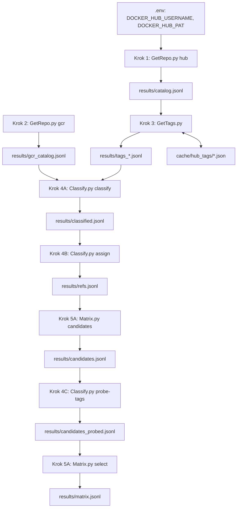

# Dokumentacja kodu fetchera (Kroki 1–5)

Dokument opisuje **istniejący kod** w `src/` — co robi każdy krok, w jakiej kolejności, jakie
pliki czyta i zapisuje oraz dlaczego działa tak, a nie inaczej. Uzasadnienia metodologiczne
(dlaczego cztery klasy, dlaczego tylko `latest` z distroless, skąd próg 10 tys.) są w
[`PLAN.md`](PLAN.md); tutaj pojawiają się tylko tam, gdzie tłumaczą konkretną linię kodu.

Krok 5 (matryca) ma `candidates` i `select`; `layers` i Krok 6 (skaner Trivy) nie mają
jeszcze kodu. Liczby z przebiegu **06.10.2026** są w §10; uzasadnienia metodologiczne
(niepełne grupy, analiza) — w [`PLAN.md`](PLAN.md).

## Spis treści

1. [Przegląd potoku](#1-przegląd-potoku)
2. [Uruchomienie](#2-uruchomienie)
3. [`hub_http.py` — wspólny klient HTTP](#3-hub_httppy--wspólny-klient-http)
4. [Krok 1 — `GetRepo.py hub`: katalog Docker Hub](#4-krok-1--getrepopy-hub-katalog-docker-hub)
5. [Krok 2 — `GetRepo.py gcr`: katalog distroless](#5-krok-2--getrepopy-gcr-katalog-distroless)
6. [Krok 3 — `GetTags.py`: tagi Docker Hub](#6-krok-3--gettagspy-tagi-docker-hub)
7. [Krok 4A — `Classify.py classify`: klasa i linia systemu](#7-krok-4a--classifypy-classify-klasa-i-linia-systemu)
8. [Krok 4B — `Classify.py assign`: ścieżka pobrania](#8-krok-4b--classifypy-assign-ścieżka-pobrania)
9. [Krok 4C — `Classify.py probe-tags`: sonda lustra](#9-krok-4c--classifypy-probe-tags-sonda-lustra)
10. [Krok 5A — `Matrix.py candidates` i `select`: matryca](#10-krok-5a--matrixpy-candidates-i-select-matryca)
11. [Formaty plików](#11-formaty-plików)
12. [Cache i wznawianie](#12-cache-i-wznawianie)
13. [Zachowania brzegowe i ograniczenia](#13-zachowania-brzegowe-i-ograniczenia)

---

## 1. Przegląd potoku

Każdy krok to osobne polecenie, które czyta plik JSONL poprzedniego kroku i zapisuje własny.
Kroki nie trzymają stanu między sobą poza tymi plikami, więc każdy da się powtórzyć niezależnie.



| Plik | Polecenie | Wejście | Wyjście | Sieć |
| --- | --- | --- | --- | --- |
| `src/hub_http.py` | — (biblioteka) | `.env` | — | — |
| `src/GetRepo.py` | `hub` | API Huba | `results/catalog.jsonl` | Hub, z tokenem |
| `src/GetRepo.py` | `gcr` | README distroless, API `gcr.io` | `results/gcr_catalog.jsonl` | GitHub, `gcr.io` |
| `src/GetTags.py` | — | `catalog.jsonl` | `results/tags*.jsonl` | Hub, z tokenem |
| `src/Classify.py` | `classify` | pliki tagów + `gcr_catalog.jsonl` | `results/classified.jsonl` | **brak** |
| `src/Classify.py` | `assign` | `classified.jsonl` | `results/refs.jsonl` | `gcr.io` |
| `src/Classify.py` | `probe-tags` | `candidates.jsonl` | `results/candidates_probed.jsonl` | `mirror.gcr.io` |
| `src/Matrix.py` | `candidates` | `refs.jsonl` | `results/candidates.jsonl` | **brak** |
| `src/Matrix.py` | `select` | `candidates_probed.jsonl` | `results/matrix.jsonl`, `results/matrix_report.json` | **brak** |

Moduły importują się nawzajem po nazwie (`from hub_http import ...`), więc skrypty uruchamia się
jako `python src/<Plik>.py` z katalogu głównego repozytorium — Python dodaje wtedy `src/` do
ścieżki importu. Wszystkie domyślne ścieżki (`results/…`, `cache/…`) są względne wobec
bieżącego katalogu.

## 2. Uruchomienie

**Zależności** (`requirements.txt`): `requests`, `requests_cache`, `python-dotenv`.
`requests_cache` jest opcjonalny:
bez niego kod działa, tylko bez cache HTTP (patrz [rozdział 12](#12-cache-i-wznawianie)).

**Środowisko `.venv`.**

Na **Windows 11** (PowerShell), z katalogu głównego repozytorium:

```powershell
python -m venv .venv
.\.venv\Scripts\python.exe -m pip install -r requirements.txt
.\.venv\Scripts\python.exe src\GetRepo.py hub
```

Na **Linuksie** terminal otwarty w Cursorze (AppImage) dziedziczy zmienne AppImage, przez które
`python3 -m venv` tworzy dowiązania do `/opt/cursor.appimage` zamiast do Pythona — takie
`.venv` nie działa. Środowisko tworzy się w czystym środowisku:

```bash
rm -rf .venv
env -i HOME=$HOME PATH=/usr/bin:/bin /usr/bin/python3 -m venv .venv
env -i HOME=$HOME PATH=/usr/bin:/bin .venv/bin/python -m pip install -r requirements.txt
```

Uruchamianie: `.venv/bin/python src/...` (Linux) albo `.\.venv\Scripts\python.exe src\...`
(Windows).

**Sekrety.** Plik `.env` w katalogu głównym (wzór: `.env.example`):

```
DOCKER_HUB_USERNAME=...
DOCKER_HUB_PAT=...
```

PAT (Personal Access Token) z ustawień konta Docker Hub, uprawnienie tylko do odczytu wystarczy.
`.env` jest w `.gitignore` i nie wolno go commitować.

**Pełny przebieg, w kolejności** (tak zostały wygenerowane obecne wyniki):

```bash
python src/GetRepo.py hub                                   # Krok 1
python src/GetRepo.py gcr                                   # Krok 2
python src/GetTags.py --source library --out results/tags_library.jsonl           # Krok 3
python src/GetTags.py --source search --min-pulls 10000 --out results/tags_search.jsonl
python src/Classify.py classify --tags results/tags_library.jsonl results/tags_search.jsonl
python src/Classify.py assign
python src/Matrix.py candidates                             # Krok 5
python src/Classify.py probe-tags --in results/candidates.jsonl --out results/candidates_probed.jsonl
python src/Matrix.py select
```

Każde polecenie przyjmuje `-v` / `--verbose` (logi na poziomie DEBUG, np. każda strona API).

## 3. `hub_http.py` — wspólny klient HTTP

Moduł bez własnego CLI. Zbiera wszystko, co Kroki 1–4 robią z HTTP tak samo: sesję z ponowieniami,
logowanie do Huba i paginację. Wydzielony, żeby `GetRepo.py` i `GetTags.py` nie duplikowały
logiki tokenu.

### Stałe

| Stała | Wartość | Po co |
| --- | --- | --- |
| `ROOT` | katalog repozytorium | stąd ładowany jest `.env`, niezależnie od bieżącego katalogu |
| `HUB_API` | `https://hub.docker.com/v2` | baza API Huba |
| `HUB_AUTH` | `…/auth/token` | wymiana PAT na JWT |
| `HUB_LIBRARY` | `…/repositories/library/` | lista repozytoriów oficjalnych |
| `HUB_SEARCH` | `…/search/repositories/` | wyszukiwarka |
| `PAGE_SIZE` | `100` | maksimum — Hub po cichu ścina większe wartości do 100 |
| `TIMEOUT` | `(10, 30)` | 10 s na połączenie, 30 s na odczyt |
| `MAX_PAGES` | `500` | bezpiecznik paginacji (50 tys. rekordów) |
| `MANIFEST_ACCEPT` | 4 typy MIME | nagłówek `Accept` dla zapytań o manifest (patrz niżej) |

`MANIFEST_ACCEPT` wymienia indeks OCI, listę manifestów Dockera, manifest Dockera v2 i manifest
OCI. Rejestr zwraca najbogatszy format, który klient deklaruje. Bez tego nagłówka rejestr może
odpowiedzieć starym formatem albo `404`, choć obraz istnieje.

Na poziomie importu moduł wywołuje `load_dotenv(ROOT / ".env")`, więc zmienne z `.env` są w
`os.environ` zanim którykolwiek skrypt o nie zapyta.

### Funkcje, w kolejności wywołania

**`build_session(use_cache=True, cache_name="cache/hub_api", *, hub_auth=False)`** — punkt wejścia
każdego skryptu z dostępem do sieci.

1. Buduje politykę ponowień `urllib3.Retry`: do 5 prób, odstęp rosnący wykładniczo
   (`backoff_factor=1.5`: ok. 1,5 s, 3 s, 6 s, 12 s…), ponawiane kody `429, 500, 502, 503, 504`,
   metody `GET`, `POST`, `HEAD`. `respect_retry_after_header=True` sprawia, że przy `429`
   (przekroczony limit zapytań) sesja czeka dokładnie tyle, ile każe nagłówek `Retry-After`.
2. Jeśli `use_cache` i `requests_cache` jest zainstalowany — tworzy `CachedSession` z bazą SQLite
   w `cache_name` (np. `cache/hub_api.sqlite`) ważną 24 h. W przeciwnym razie zwykłą
   `requests.Session`; gdy cache był żądany, a biblioteki brak, loguje ostrzeżenie.
3. Podpina politykę ponowień pod wszystkie adresy `https://` i ustawia `User-Agent`.
4. Jeśli `hub_auth=True` — wywołuje `fetch_jwt` i ustawia nagłówek `Authorization: Bearer <JWT>`
   na całą sesję.

**`require_env(name)`** — zwraca zmienną środowiskową albo kończy program (`SystemExit`)
z komunikatem, której brakuje.

**`fetch_jwt(session, username, pat)`** — `POST /v2/auth/token` z `{"identifier", "secret"}`.
Docker Hub **nie przyjmuje PAT jako tokenu Bearer**; trzeba go najpierw wymienić na JWT. Funkcja
akceptuje oba nazwy pola w odpowiedzi (`access_token` i `token`) i kończy program przy kodzie
innym niż 200 lub braku tokenu.

**`fetched_at(response)`** — znacznik czasu pobrania w ISO 8601 (UTC). Dla odpowiedzi z cache
bierze `response.created_at`, czyli chwilę **pierwotnego** pobrania, a nie odczytu z cache —
dzięki temu `fetched_at` w wynikach mówi prawdę o świeżości danych.

**`get_page(session, url, params)`** — jedna strona API jako `(json, fetched_at)`. Osobno wykrywa
`403` z tekstem „anonymous”: oznacza on, że Hub potraktował zapytanie jako anonimowe mimo tokenu
(token wygasł albo nagłówek się zgubił), i zgłasza czytelny błąd zamiast ogólnego `HTTPError`.
Każdy inny błąd HTTP podnosi `raise_for_status()`.

**`iter_pages(session, url, params=None, max_pages=MAX_PAGES)`** — generator stron. Działa na
polu `next` odpowiedzi Huba:

1. Pobiera stronę i ją oddaje (`yield`).
2. Bierze `payload["next"]` jako kolejny adres, a `params` zeruje — adres `next` zawiera już
   wszystkie parametry, więc ponowne ich dołączenie zdublowałoby je.
3. Kończy, gdy `next` jest puste, albo po `max_pages` stronach.
4. Pamięta odwiedzone adresy; jeśli `next` wskaże adres już odwiedzony, zgłasza błąd zamiast
   kręcić się w nieskończoność.

## 4. Krok 1 — `GetRepo.py hub`: katalog Docker Hub

**Cel:** lista repozytoriów, z których w Kroku 3 pobierane są tagi.

```bash
python src/GetRepo.py hub [--out results/catalog.jsonl] [--search-pages 47]
                          [--queries python java nodejs] [--no-cache] [-v]
```

### Model danych

`Repo` (niezmienny `dataclass`): `namespace`, `name`, `pull_count`, `star_count`, `last_updated`,
`is_official`, `source` (`library` / `search`), `query` (dla wyszukiwania), `fetched_at` oraz
`raw` — pełny, nieprzetworzony rekord z API, zachowany na wypadek, gdyby później potrzebne było
pole, którego nie wyciągnęliśmy. Właściwość `key` to `namespace/name`; `to_record()` dopisuje ją
jako `repo_key`.

Dwie funkcje mapujące, bo dwa źródła mają różne kształty rekordów:

- `from_library(raw, moment)` — endpoint `library/` zwraca bogaty rekord, w tym `last_updated`.
- `from_search(raw, query, moment)` — wyszukiwarka zwraca `repo_name` w postaci `ns/name`
  (rozcinane `rpartition("/")`; brak ukośnika oznacza `library`), nie zwraca `last_updated`,
  a `is_official` bierze z odpowiedzi.

### Przebieg `build_hub_catalog`

1. `main()` tworzy sesję z `hub_auth=True` i cache `cache/hub_api`.
2. **Faza A — `library/`.** `iter_pages` po `HUB_LIBRARY` z `page_size=100`. Każdy rekord trafia
   przez `from_library` do `emit`. Na końcu log porównuje liczbę zapisanych z `count`
   deklarowanym przez API — to kontrola, czy paginacja przeszła do końca (wynik: 181 z 181).
3. **Faza B — wyszukiwanie.** Dla każdego zapytania z `--queries` (domyślnie `python`, `java`,
   `nodejs` — technologie, nie klasy utwardzenia) `iter_pages` po `HUB_SEARCH`, ograniczone do
   `--search-pages` stron. Rekordy przez `from_search` do `emit`.
4. **`emit`** to domknięcie z deduplikacją: zbiór `seen` kluczy `repo_key`. Repozytorium już
   zapisane (np. `library/python` znalezione drugi raz przez wyszukiwarkę, albo repozytorium
   trafione dwoma zapytaniami) jest pomijane. Wygrywa więc **pierwsze wystąpienie** — dla
   oficjalnych jest to bogatszy rekord z fazy A.
5. Zapis strumieniowy, linia po linii (JSONL), więc nawet przerwany przebieg zostawia poprawny
   początek pliku.

Wynik 29.09.2026 (domyślne `--search-pages 47`): 181 oficjalnych + 12 790 z wyszukiwania
= 12 971 repozytoriów. Większość wyników wyszukiwarki to szum o niskim `pull_count` — odsiewa go
dopiero próg `--min-pulls` w Kroku 3.

## 5. Krok 2 — `GetRepo.py gcr`: katalog distroless

**Cel:** jeden wiersz na każde repozytorium `gcr.io/distroless/*` z jawną linią Debiana,
tag `latest`, plus informacja, czy istnieje wariant `nonroot`.

```bash
python src/GetRepo.py gcr [--out results/gcr_catalog.jsonl] [--no-cache] [-v]
```

Sesja bez tokenu Huba (`hub_auth=False`), z własnym cache `cache/gcr_api`.

### Model danych

`DistrolessRepo`: `registry` (`gcr.io`), `namespace` (`distroless`), `name`
(np. `python3-debian13`), `tag` (zawsze `latest`), `logical_ref`
(`gcr.io/distroless/python3-debian13:latest`), `nonroot_available`, `in_readme`, `source` (`gcr`),
`fetched_at`, `raw` (skąd odkryto: `readme+children` albo `children`). `repo_key` to
`gcr.io/distroless/<name>`.

### Przebieg `build_gcr_catalog`

1. **README.** `fetch_readme_images` pobiera `README.md` projektu distroless z GitHuba, a
   `parse_readme_images` wyciąga wyrażeniem regularnym wszystkie nazwy po `gcr.io/distroless/`.
   README to lista obrazów, które Google oficjalnie wspiera (12 z linii `debian13`).
2. **Dzieci projektu.** `list_distroless_children` robi `GET gcr.io/v2/distroless/tags/list`
   i bierze pole `child` — listę podrepozytoriów (77 pozycji). Celowo **nie** korzysta z pola
   `manifest` tej odpowiedzi, które wylicza wszystkie manifesty i jest ogromne.
3. **Wybór kandydatów** (`candidate_distroless_names`):
   - z dzieci zostają tylko nazwy pasujące do `^.+-debian\d+$` — z jawną linią Debiana;
     aliasy bez sufiksu (`python3`, `base`) są pomijane, bo wskazują te same warstwy co
     najnowszy `-debianN` i dublowałyby obserwacje;
   - odpada `test` oraz wszystko z końcówką `.sig` / `.att` (podpisy i atestacje, nie obrazy);
   - dokładane są wszystkie nazwy z README;
   - wynik jest posortowany, więc kolejność w pliku jest powtarzalna.
4. **Sonda istnienia.** Dla każdego kandydata `manifest_exists(session, name, "latest")`:
   - `HEAD gcr.io/v2/distroless/<name>/manifests/latest` z `MANIFEST_ACCEPT` — sam nagłówek,
     bez pobierania czegokolwiek;
   - `200` → jest, `404` → nie ma;
   - `400` / `405` → część rejestrów nie obsługuje `HEAD`, więc ponawia jako `GET` ze
     `stream=True` i natychmiast zamyka połączenie (nie ściąga treści);
   - każdy inny kod jest błędem.
   Kandydat bez `latest` jest pomijany i liczony w `skipped_no_latest`.
5. **Wariant `nonroot`.** Drugie `manifest_exists` dla tagu `nonroot`. Wynik zapisuje się tylko
   jako flaga `nonroot_available` — obraz `nonroot` nie staje się osobnym wierszem.
6. Zapis wiersza i log `latest=ok nonroot=… readme=…`.

Wynik 29.09.2026: 56 repozytoriów (linie `debian9`–`debian13`), 51 z `nonroot_available`.

### Filtr tagów `is_rejected_tag`

`REJECT_TAG_RE` odrzuca: `.sig` / `.att`, prefiks `update-available-`, `sha256-…`, 40-znakowe
skróty commitów, `debug` / `debug-nonroot` / `nonroot` oraz sufiksy architektur. Obecny przebieg
go nie wywołuje, bo bierze tylko `latest`; funkcja zostaje jako gotowa reguła na wypadek
rozszerzenia enumeracji tagów.

## 6. Krok 3 — `GetTags.py`: tagi Docker Hub

**Cel:** pełna lista tagów każdego wybranego repozytorium, z digestem indeksu i digestem obrazu
amd64.

```bash
python src/GetTags.py [--catalog results/catalog.jsonl] [--out results/tags.jsonl]
                      [--cache-dir cache/hub_tags] [--repos NAZWA ...]
                      [--source library|search] [--min-pulls N] [--limit N]
                      [--no-disk-cache] [--no-cache] [-v]
```

Token jest tu wymagany: bez niego Hub odmawia (`403`) od przesunięcia 1000, czyli po 10 stronach
przy `page_size=100`, a `python` ma 3923 tagi, `openjdk` ponad 17 tys.

### Model danych

`TagRecord`: `repo_key`, `namespace`, `name`, `tag`, `logical_ref`, `full_size`, `digest`,
`tag_last_pushed`, `arch_digest`, `arch_size`, `fetched_at`.

- `digest` — digest tego, na co wskazuje tag; zwykle **indeks** wieloarchitekturowy.
- `arch_digest` / `arch_size` — digest i rozmiar **obrazu linux/amd64** z tego indeksu. To on
  jest dalej kluczem aliasów, deduplikacji i pinowania `pull_ref`.
- `logical_ref` — nazwa do pracy: `library/python:3.13` → `python:3.13`, inaczej
  `ns/name:tag` (funkcja `logical_ref`).

### Wybór repozytoriów — `select_repos`

Filtry stosowane po kolei:

1. `--source` — tylko wiersze z danego źródła Kroku 1.
2. `--min-pulls N` — repozytoria z wyszukiwania z `pull_count ≥ N`; **`library/` przechodzi
   zawsze**, bo próg służy do odsiania szumu z wyszukiwarki, nie do cięcia oficjalnych.
3. `--repos` — jeśli podane, **zastępuje** wynik dwóch poprzednich filtrów: wybiera z całego
   katalogu wiersze pasujące po `name` lub `repo_key`. Nazwy, których nie ma w katalogu, są
   dodawane syntetycznie (`python` → `library/python`, `ns/name` → jak podano) z ostrzeżeniem.
   Dzięki temu pilot (`--repos python`) działa nawet bez `catalog.jsonl`.
4. `--limit N` — pierwsze N wierszy po wszystkich filtrach.

### Przebieg

1. `main()` wczytuje katalog (`load_catalog`; brak pliku kończy program z podpowiedzią, chyba że
   podano `--repos`), wybiera repozytoria i tworzy sesję z tokenem.
2. Cache HTTP (SQLite) jest **wyłączony, gdy działa cache dyskowy** (domyślnie). Cache dyskowy
   jest źródłem prawdy dla wznawiania, a dwa cache naraz tylko by się dublowały. Cache HTTP
   włącza dopiero `--no-disk-cache` (i tylko bez `--no-cache`).
3. `build_tags` iteruje po repozytoriach z logiem `[i/N] ns/name` i dla każdego woła
   `fetch_repo_tags`.
4. **`fetch_repo_tags`:**
   1. Sprawdza `cache/hub_tags/<ns>__<name>.json` (nazwa oczyszczona z niebezpiecznych znaków
      przez `cache_path`). Jeśli plik istnieje i ma `"complete": true` — odtwarza z niego
      rekordy i **nie wysyła żadnego zapytania**.
   2. W przeciwnym razie paginuje `GET /v2/repositories/<ns>/<name>/tags/?page_size=100`
      i każdy wynik zamienia w `TagRecord` przez `tag_from_raw`.
   3. `tag_from_raw` wybiera obraz amd64 funkcją `pick_amd64`: najpierw `architecture=amd64`
      z `os` równym `linux` lub pustym, a jeśli takiego nie ma — pierwszy dowolny amd64. Brak
      amd64 daje `arch_digest = None` (Krok 4 oznaczy to jako `no_amd64`).
   4. Porównuje liczbę pobranych z `count` z API i ostrzega, jeśli jest mniej (sygnał uciętej
      paginacji).
   5. Zapisuje cache z `complete: true`. Plik powstaje **dopiero po pobraniu ostatniej strony**,
      więc przerwane pobieranie nie zostawia połowicznego wpisu uznanego za kompletny.
5. `HTTPError 404` dla repozytorium (usunięte z Huba między Krokiem 1 a 3) jest logowane
   i pomijane, a na końcu wypisywana jest lista pominiętych. Każdy inny błąd przerywa przebieg —
   po ponownym uruchomieniu gotowe repozytoria wczytają się z cache.
6. Tagi są zapisywane do `--out` **zgrupowane per repozytorium**, w kolejności katalogu. Na tej
   własności opiera się Krok 4A.

Wynik 29.09.2026: `tags_library.jsonl` 187 879 tagów ze 179 repozytoriów, `tags_search.jsonl`
146 698 tagów z 645 repozytoriów (próg 10 tys.). Pełny przebieg wyszukiwania trwał ok. 9 minut.

## 7. Krok 4A — `Classify.py classify`: klasa i linia systemu

**Cel:** każdemu tagowi przypisać klasę utwardzenia, linię systemu bazowego, wersję i powód
ewentualnego wykluczenia. **Offline** — zero zapytań sieciowych, więc można go powtarzać
dowolnie przy każdej zmianie reguł.

```bash
python src/Classify.py classify [--tags results/tags.jsonl ...]
                                [--gcr results/gcr_catalog.jsonl] [--no-gcr]
                                [--out results/classified.jsonl] [-v]
```

Domyślne `--tags` to plik pilota; w pełnym przebiegu trzeba podać oba pliki tagów.

Zasada: **nic nie jest usuwane**. Wiersz wykluczony zostaje w pliku z wypełnionym
`excluded_reason`; decyzja, co trafia do próby, należy do Kroku 5.

### `parse_tag(tag, repo_key)` — rozbiór tagu

Tag jest zamieniany na małe litery i cięty po `-` na tokeny. Każdy token przechodzi przez reguły
**w tej kolejności**; pierwsza pasująca go „zjada” (`continue`), niepasujące lądują w `leftover`:

| Kolejność | Reguła | Efekt |
| --- | --- | --- |
| 1 | prefiks `windowsservercore`, `nanoserver`, `ltsc`, `windows` | `excluded = "windows"` |
| 2 | 4 cyfry, gdy już jest `windows` (`1809`) | pomijany — numer wydania Windows |
| 3 | `onbuild` | `excluded = "onbuild"` (jeśli nie było już `windows`) |
| 4 | `alpine` lub `alpineX.Y` | klasa `alpine`; z wersją → `os_line = alpineX.Y` |
| 5 | `slim` | klasa `slim`, **chyba że już jest `alpine`** |
| 6 | kodowa nazwa Debiana (`trixie`…) | `os_line = debianN` |
| 7 | suita Debiana (`sid`, `stable`…), **tylko w `library/debian`** | `os_line` + ew. `prerelease` |
| 8 | kodowa nazwa Ubuntu (`noble`…) | `os_line = ubuntuX.Y` |
| 9 | `oraclelinux9`, `ubi8`, `centos7`, `al2023`… | `os_line = <nazwa><numer>` |
| 10 | `rc`, `beta2`, `preview`, `nightly`, `edge`, `unstable`, `ea`… | `prerelease = True` |
| 11 | `latest` | pomijany |
| 12 | wersja (`3.13`, `v1.2.3`, `3.14.0rc1`) **na pozycji 0** | `version`; sufiks `a/b/rc/…` → `prerelease` |
| — | cokolwiek innego | `leftover`, sklejane `-` w `flavor` (np. `fpm`, `jdk`, `apache`) |

Przykłady:

| Tag | variant | os_line | version | prerelease | flavor | excluded |
| --- | --- | --- | --- | --- | --- | --- |
| `3.13-slim-trixie` | slim | debian13 | 3.13 | nie | — | — |
| `3.10.21-alpine3.24` | alpine | alpine3.24 | 3.10.21 | nie | — | — |
| `3.14.0rc1-slim` | slim | — | 3.14.0rc1 | tak | — | — |
| `21-jdk-windowsservercore-1809` | standard | — | 21 | nie | jdk | windows |
| `8.3-fpm-alpine` | alpine | — | 8.3 | nie | fpm | — |
| `latest` | standard | — | — | nie | — | — |

Dlaczego suity Debiana tylko w `library/debian`: w innych repozytoriach `unstable` oznacza
kanał wydań samej aplikacji (`mongo:4.1-unstable`), a nie Debiana sid — przy globalnej regule
takie tagi dostawały fałszywą linię systemu i sprzeczności przy aliasach.

### `classify_hub_tag(row)` — poprawki zależne od repozytorium

1. Wywołuje `parse_tag`.
2. Dla repozytoriów bazowych (`library/alpine`, `library/debian`, `library/ubuntu`) linię
   systemu wyznacza wersja z tagu (`base_os_line`): `alpine:3.22` → `alpine3.22`,
   `debian:12.8` → `debian12`, `ubuntu:24.04` → `ubuntu24.04`. `library/alpine` jest zawsze
   klasy `alpine` (`variant_rule = base_os_repo`), bo jego tagi nie zawierają słowa „alpine”.
3. Tag bez obrazu amd64 (`arch_digest` pusty) dostaje `excluded_reason = "no_amd64"`, o ile nie
   był już wykluczony z innego powodu.
4. Składa wiersz wyjściowy: `family` = nazwa repozytorium, `vendor` = przestrzeń nazw,
   `source_registry = hub`, `os_line_source = "tag"` jeśli linia pochodzi z samego tagu, plus
   digesty i rozmiary przepisane z Kroku 3.

### `resolve_aliases(rows)` — linia systemu z aliasu

Tagi `3.13`, `3.13-slim`, `latest` nie mówią, na jakim Debianie stoją, ale wskazują ten sam
obraz co `3.13-trixie` / `3.13-slim-trixie`. Funkcja działa na wszystkich tagach **jednego
repozytorium**:

1. Buduje mapę `klucz obrazu → zbiór znanych linii`, gdzie klucz to `arch_digest`
   (awaryjnie `digest`, `_alias_key`). Digest indeksu nie nadaje się: `python:3.13`
   i `python:3.13-trixie` mają różne indeksy (pierwszy zawiera też obrazy Windows), a ten sam
   obraz amd64.
2. Każdemu tagowi bez linii, którego obraz ma **dokładnie jedną** znaną linię, przypisuje ją
   i ustawia `os_line_source = "alias"`.
3. Przy kilku różnych liniach dla jednego obrazu nic nie zgaduje — loguje ostrzeżenie
   „sprzeczne linie OS dla digestu” i zostawia pole puste.

Wynik 29.09.2026: 39 463 tagi dostały linię z aliasu.

### `classify_distroless(row)` — wiersze GCR

Stała klasa `distroless` (`variant_rule = gcr`). Linia systemu z sufiksu nazwy
(`python3-debian13` → `debian13`, `os_line_source = repo_name`), `flavor` = nazwa bez sufiksu.
`family` przez `distroless_family` — dopasowanie prefiksu do technologii partnera z Huba:
`python*` → `python`, `nodejs*` → `node`, `java*` → `java`, `static` / `base*` / `cc` → `base`.
Przepisywana jest flaga `nonroot_available`. Digesty są puste — uzupełnia je Krok 4B.

### `classify(tag_paths, gcr_path, out_path)` — przebieg

1. `read_jsonl` czyta kolejno wszystkie pliki tagów jako jeden strumień.
2. `itertools.groupby` po `repo_key` tnie strumień na grupy per repozytorium. Działa to tylko
   dlatego, że Krok 3 zapisuje tagi zgrupowane. Pamięć zużywa jedna grupa, a nie 330 tys. wierszy.
3. Jeśli to samo `repo_key` pojawi się drugi raz (ten sam plik podany dwukrotnie albo
   repozytorium w dwóch plikach), program kończy się błędem — inaczej aliasy tego repozytorium
   rozwiązywałyby się na niepełnych danych.
4. Dla grupy: `classify_hub_tag` na każdym wierszu, `resolve_aliases` na całości, zapis.
5. Na końcu dopisuje wiersze distroless (chyba że `--no-gcr`).
6. Zwraca liczniki wypisywane w logu: `variant:*` (**łącznie z wykluczonymi**), `excluded:*`
   (`excluded:None` = zakwalifikowane), `alias_resolved`, `os_line_missing` (tylko wśród
   zakwalifikowanych), `hub_repos`.

## 8. Krok 4B — `Classify.py assign`: ścieżka pobrania

**Cel:** każdemu wierszowi przypisać rejestr i `pull_ref` — dokładny adres, z którego skaner
pobierze obraz, przypięty digestem.

```bash
python src/Classify.py assign [--in results/classified.jsonl] [--out results/refs.jsonl] [-v]
```

Sesja **bez cache HTTP i bez tokenu Huba** (wspólna dla `assign` i `probe-tags`, patrz
[rozdział 12](#12-cache-i-wznawianie)).

### Przebieg `assign`

Dla każdego wiersza `classified.jsonl`:

- **Distroless (`source_registry = gcr`)** — `resolve_gcr_digests`:
  1. `GET gcr.io/v2/distroless/<name>/manifests/latest` z `MANIFEST_ACCEPT`;
  2. digest indeksu z nagłówka `Docker-Content-Digest`;
  3. w liście `manifests` szuka wpisu z `platform` = `linux/amd64` i bierze jego digest;
  4. jeśli odpowiedź nie jest indeksem (brak `manifests`), sam manifest uznaje za obraz amd64.

  Zapisuje `digest`, `arch_digest`, `registry = gcr` i
  `pull_ref = gcr.io/distroless/<name>@sha256:<amd64>`.
- **Docker Hub** — `registry = mirror` i `pull_ref` z `hub_pull_ref(row, via_mirror=True)`:
  `mirror.gcr.io/<repo_key>@<arch_digest>`, np.
  `mirror.gcr.io/library/python@sha256:…`. Bez `arch_digest` `pull_ref` jest pusty.
- Wszystkim: `mirror_ok = None`, `mirror_probe = None` — skierowanie Huba przez lustro jest
  **wstępne i niezweryfikowane**; potwierdza je dopiero sonda.

Pinowanie digestem zamiast tagiem gwarantuje, że skanowany jest dokładnie obraz opisany
w matrycy, nawet jeśli tag zostanie w międzyczasie przesunięty na nowszy build. Digest amd64
zamiast digestu indeksu sprawia, że skaner nie musi wybierać architektury.

Liczniki `registry:*` liczą tylko wiersze niewykluczone.

## 9. Krok 4C — `Classify.py probe-tags`: sonda lustra

**Cel:** sprawdzić, czy lustro `mirror.gcr.io` ma każdy obraz-kandydat (po `arch_digest`).
Wynik zapisuje `mirror_probe` / `registry` / `pull_ref`. **Do matrycy nie wchodzi Hub** —
`Matrix.py select` odrzuca wiersze z `registry = hub` (`miss`). Log `budget_line` liczy
kandydatów oznaczonych jako Hub **po sondzie** (ostrzeżenie o skali, gdyby ktoś brał Hub);
po decyzji 05.10.2026 te wiersze i tak odpadają przed losowaniem.

```bash
python src/Classify.py probe-tags --in results/candidates.jsonl \
    --out results/candidates_probed.jsonl [--retry-delay 60] [-v]
```

Uruchamiana na **kandydatach** (`Matrix.py candidates`, ~28 tys. wierszy), przed `select` —
nie na 270 tys. tagów. Przebieg 06.10.2026: 9 459 `hit`, 2 206 `cold_miss`, **16 377 `miss`**
(~58%); pierwsza fala ~2–2,5 h, potem cisza na ponowieniach chybień (brak logu co 500
w przebiegu 2), łącznie ok. 2,5–4 h.

### `head_manifest(session, host, repo, reference)`

`HEAD https://<host>/v2/<repo>/manifests/<reference>` z `MANIFEST_ACCEPT`, z podążaniem za
przekierowaniami. Zwraca kod HTTP: `200` = jest, `404` = brak. Inny kod 4xx jest logowany jako
ostrzeżenie i zwracany (dalej traktowany jak brak); 5xx po wyczerpaniu ponowień sesji przerywa
program.

### Przebieg `probe_tags`

1. Wczytuje całe wejście do pamięci.
2. Wybiera wiersze do sondy: `registry` równe `mirror` lub `hub` i niepusty `arch_digest`.
   Distroless (`registry = gcr`) jest przepuszczany bez zmian.
3. **Przebieg 1.** Dla każdego: `head_manifest(mirror.gcr.io, repo_key, arch_digest)` — zapytanie
   o obraz **po digeście amd64**, więc potwierdza, że lustro ma dokładnie ten artefakt. `200` →
   `mirror_probe = "hit"`; cokolwiek innego → lista `first_miss`. Co 500 wierszy log postępu.
4. **Odczekanie.** Jeśli były chybienia: `time.sleep(--retry-delay)`. Lustro to pull-through
   cache — pierwsze `404` często znaczy „jeszcze nie mam, właśnie ściągam z Huba”.
5. **Przebieg 2** — tylko na chybieniach, **bez** logu co 500: `200` → `cold_miss`,
   inaczej `miss`. Stąd długa cisza w logu przy dużej liczbie chybień.
6. **Zapis.** Dla każdego sondowanego wiersza:
   - `mirror_ok = (mirror_probe != "miss")`;
   - `registry = mirror` albo `hub`;
   - `pull_ref` przeliczony: `mirror.gcr.io/…@digest` albo `docker.io/…@digest`;
   - `mirror_probed_at` = bieżący czas UTC.
   Wiersze niesondowane (distroless) są zapisywane bez zmian, w oryginalnej kolejności.
7. Liczniki `probe:*` i `registry:*`, a na końcu log `matryca: …` z `budget_line` —
   liczba kandydatów z `registry:hub` po sondzie (nie finalna matryca). Przy przebiegu
   06.10 było to 16 377; `select` je potem odrzuca.

Test 29.09.2026 na 15 wierszach: 8 `hit`, 6 `miss` (stare tagi, np. `python:2.7.9-wheezy`,
`mysql:5.7.18`, `redis:2.8.18`), distroless przepuszczony.

## 10. Krok 5A — `Matrix.py candidates` i `select`: matryca

**Cel:** z ~335 tys. wierszy `refs.jsonl` wybrać ok. 10 tys. obrazów ułożonych w grupy, w których
każdą klasę utwardzenia da się porównać z `standard` tej samej technologii i wersji, bez
pobierania czegokolwiek z Docker Huba. Oba polecenia są **offline**; pomiędzy nimi idzie
sonda lustra (sieć):

```bash
python src/Matrix.py candidates [--in results/refs.jsonl] [--out results/candidates.jsonl] [-v]
python src/Classify.py probe-tags --in results/candidates.jsonl --out results/candidates_probed.jsonl
python src/Matrix.py select [--in results/candidates_probed.jsonl] [--out results/matrix.jsonl]
                            [--report results/matrix_report.json] [--target 10000]
                            [--pair-cap 99999] [--desc-cap 150] [--seed 2026] [-v]
```

Domyślne `--pair-cap` to **99999** (bez praktycznego limitu — cała pula par z lustra).
Wcześniejsza wartość 300 ucinała ~1,9 tys. obrazów w parach (`library/node`, `library/debian`).
Dominacja tych repo w N jest OK: główny test w pracy to mediana delt per repozytorium
(patrz `PLAN.md`).

Sonda idzie **przed** losowaniem: gdyby szła po nim, odrzucenie `miss` rozbijałoby pary.
Czas: ok. 2,5–4 h na ~28 tys. kandydatów (po kolei; druga fala bez logu postępu).

Z `Classify.py` importowana jest tylko funkcja `read_jsonl`.

### Stałe

| Stała | Po co |
| --- | --- |
| `PARTNER_REPO` | technologia distroless → repozytorium `library/` partnera: `python` → `library/python`, `node` → `library/node`, `java` → `library/openjdk`, `base` → `library/debian` |
| `PYTHON_BY_DEBIAN` | wersja Pythona w `python3-debianN`, odczytana z `Entrypoint` w configu obrazu (01.10.2026): `debian9` 3.5 … `debian13` 3.13 |

### Przebieg, w kolejności

Kroki 1–3 wykonuje `candidates` (zapis `results/candidates.jsonl`, ok. 28 tys. wierszy),
kroki 4–10 — `select`.

1. **Filtr** (`is_candidate`): wiersz `library/` albo distroless, bez `excluded_reason`, bez
   `prerelease`, z `arch_digest`. Repozytoria z wyszukiwania odpadają tutaj.
2. **Dedup po obrazie amd64** (`dedup_by_digest`): jeden wiersz na `arch_digest`. Wygrywa tag
   wyżej oceniony przez `tag_score` — z wersją i z linią OS z samego tagu (dla distroless: ten,
   którego wersję runtime'u znamy). Tagi pozostałych wierszy trafiają do listy `aliases`.
3. **Reguła minor** (`keep_newest_per_minor`): dla klucza (repozytorium, wersja `X.Y` z funkcji
   `minor`, `flavor`, klasa, linia OS) zostaje wiersz z najpóźniejszym `tag_last_pushed`.
4. **Wczytanie wyniku sondy** (`load_probed`): wiersz Huba bez `mirror_probe` kończy program
   z komunikatem „uruchom najpierw probe-tags”. Wiersze z `registry = hub` (sonda: `miss`) są
   odrzucane i liczone w logu; distroless przechodzi bez zmian.
5. **Grupy Hub** (`build_hub_groups`): wiersze z tym samym (repozytorium, `X.Y`, `flavor`) dzielone
   są według linii OS — każda linia to osobna grupa z obrazami `standard` i `slim`. Najnowszy
   obraz `alpine` tej wersji dołącza do grupy z najnowszym `standard`; gdy `standard` nie ma,
   tworzy własną grupę. `group_id` ma postać `library/python:3.13:-:debian13`.
6. **Parowanie distroless** (`attach_distroless`, `find_partner_group`):
   - `runtime_version` daje wersję runtime'u z nazwy obrazu: `python3` z `PYTHON_BY_DEBIAN`,
     `nodejs22` → `22`, `java21` → `21`, `base`/`static`/`cc`/`base-nossl` → numer Debiana.
     Dla `nodejs-debianN`, `java-debianN` i `java-base-*` wersji nie ma, więc nie ma partnera;
   - szukana jest grupa repozytorium z `PARTNER_REPO`, której wersja zaczyna się od wersji
     runtime'u (`version_matches`: `22` pasuje do `22.23`) i której `standard` stoi na tej samej
     linii Debiana. Spośród pasujących wygrywa grupa bez `flavor`, a potem z najnowszym
     `standard`;
   - obraz bez partnera tworzy własną, jednoosobową grupę.
   Log wypisuje dla każdego obrazu distroless, do której grupy trafił.
7. **Oznaczenie grup** (`mark_pairs`): `paired` — grupa ma `standard` i co najmniej jedną inną
   klasę; `triangle` — ma `standard` i distroless.
8. **Warstwa `pairs`:** wszystkie grupy sparowane, w każdym repozytorium brane przez
   `pick_groups` (ziarno `--seed`) do `--pair-cap` obrazów. Przy domyślnym 99999 wchodzi
   praktycznie cała pula par z lustra. Grupy z distroless wchodzą zawsze, pozostałe w losowej
   kolejności; grupa wchodzi w całości albo wcale. W grupie `standard` jest **jednym**
   wierszem — delty slim/alpine/distroless liczą się względem niego przy jednym skanie.
9. **Warstwa `descriptive`:** grupy bez pary dopełniają matrycę do `--target`. Każde
   repozytorium ma wagę `log(1 + liczba grup)` i dostępną liczbę obrazów przyciętą do
   `--desc-cap`; `allocate_quotas` dzieli wolne miejsce (target minus warstwa `pairs` minus
   distroless bez partnera) proporcjonalnie do wag — repozytorium, które nie wypełni swojej
   części, dostaje tyle, ile ma, a reszta jest dzielona od nowa. Distroless bez partnera
   wchodzi zawsze. Gdy sama warstwa `pairs` przekracza `--target`, log ostrzega, a warstwa
   opisowa jest pusta.
10. **Zapis:** wiersze wybranych grup z dopisanymi `group_id`, `stratum`, `paired`, `triangle`;
    raport (`build_report`) z liczbą obrazów per warstwa i klasa, liczbą par per klasa
    i repozytoriów z parą, liczbą obrazów na repozytorium i statusem każdego obrazu distroless.

**Przebieg 06.10.2026** (świeże Kroki 1–4, sonda, `select` z `--pair-cap 99999`, ziarno 2026):

| | Wartość |
| --- | --- |
| katalog Hub / GCR | 13 516 repo; 56 distroless |
| tagi | library 188 688 + search 148 726 |
| candidates | 28 097 |
| po sondzie (lustro/GCR) | 11 720 (odrzucone Hub-only: 16 377) |
| matryca | **9 923** obrazów (do targetu 10 000 brakuje 77 — wyczerpana pula descriptive) |
| stratum | pairs 5 469 / descriptive 4 454 |
| klasy | standard 6 361, alpine 1 808, slim 1 699, distroless 55 |
| pary | slim 1 529, alpine 1 336, distroless 27 |
| repo z parą | slim 21, alpine 53, distroless 4 |
| pełne 4 klasy / trójki alpine+slim+standard | 8 / 294 |

Symulacja 05.10.2026 (100% lustra, bez prawdziwej sondy) dawała górną granicę ~9 940 przy
`pair_cap=300` i innym rozkładzie warstw — **nie obowiązuje**; liczby powyżej są wiążące.
Jak analizować niepełne grupy: `PLAN.md` → sekcja „Niepełne grupy”.

## 11. Formaty plików

Wszystkie wyniki to **JSONL**: jeden obiekt JSON na linię, UTF-8, bez znaków ucieczki dla
polskich liter (`ensure_ascii=False`). Czyta się je strumieniowo i dopisuje linia po linii.

### `results/catalog.jsonl` (Krok 1)

| Pole | Opis |
| --- | --- |
| `repo_key` | `namespace/name` — klucz w całym potoku |
| `namespace`, `name` | np. `library`, `python` |
| `pull_count`, `star_count` | popularność z API |
| `last_updated` | tylko dla `library/` |
| `is_official` | czy repozytorium oficjalne |
| `source` | `library` / `search` |
| `query` | zapytanie, które je znalazło (dla `search`) |
| `fetched_at` | czas pobrania strony API |
| `raw` | pełny rekord API |

### `results/gcr_catalog.jsonl` (Krok 2)

`repo_key` (`gcr.io/distroless/<name>`), `registry`, `namespace`, `name`, `tag` (`latest`),
`logical_ref`, `nonroot_available`, `in_readme`, `source` (`gcr`), `fetched_at`,
`raw.discovered_via`.

### `results/tags_*.jsonl` (Krok 3)

`repo_key`, `namespace`, `name`, `tag`, `logical_ref`, `full_size` (suma po architekturach),
`digest` (indeks), `tag_last_pushed`, `arch_digest`, `arch_size` (obraz amd64), `fetched_at`.

### `results/classified.jsonl` (Krok 4A)

| Pole | Opis |
| --- | --- |
| `repo_key`, `tag`, `logical_ref` | identyfikacja |
| `source_registry` | `hub` / `gcr` — skąd wiersz pochodzi |
| `family` | technologia (Hub: nazwa repozytorium; GCR: mapowanie) |
| `vendor` | przestrzeń nazw / `distroless` |
| `variant` | `standard` / `slim` / `alpine` / `distroless` |
| `variant_rule` | która reguła nadała klasę (`default`, `slim`, `alpine`, `base_os_repo`, `gcr`) |
| `os_line` | np. `debian13`, `alpine3.22`, `ubuntu24.04`, `ubi9` |
| `os_line_source` | `tag` / `alias` / `repo_name` / pusty |
| `version` | wersja z pierwszego tokenu tagu |
| `prerelease` | wydanie przedpremierowe |
| `flavor` | tokeny nierozpoznane (`fpm`, `jdk`, …) |
| `excluded_reason` | `windows` / `onbuild` / `no_amd64` / pusty |
| `nonroot_available` | tylko wiersze GCR |
| `digest`, `arch_digest`, `arch_size`, `full_size`, `tag_last_pushed` | z Kroku 3 |

### `results/refs.jsonl` (Krok 4B) i wynik `probe-tags` (Krok 4C)

Wszystkie pola `classified.jsonl` plus:

| Pole | Po `assign` | Po `probe-tags` |
| --- | --- | --- |
| `registry` | `mirror` (Hub) / `gcr` | `mirror` / `hub` / `gcr` |
| `pull_ref` | `mirror.gcr.io/…@sha256:…` / `gcr.io/distroless/…@sha256:…` | przeliczony wg wyniku sondy |
| `mirror_ok` | `null` | `true` / `false` |
| `mirror_probe` | `null` | `hit` / `cold_miss` / `miss` |
| `mirror_probed_at` | — | czas sondy |

Dla wierszy GCR `assign` wypełnia też `digest` i `arch_digest`.

### `results/matrix.jsonl` i `results/matrix_report.json` (Krok 5A)

`matrix.jsonl`: wszystkie pola `refs.jsonl` plus:

| Pole | Opis |
| --- | --- |
| `aliases` | pozostałe tagi wskazujące ten sam obraz amd64 |
| `group_id` | grupa porównawcza, np. `library/python:3.13:-:debian13` |
| `stratum` | `pairs` (porównania) / `descriptive` (tylko opis ekosystemu) |
| `paired` | grupa ma `standard` i ≥ 1 klasę utwardzoną |
| `triangle` | grupa ma `standard` i distroless |

Wiersze jednej grupy leżą obok siebie. `matrix_report.json` to podsumowanie przebiegu:
parametry (`target`, `pair_cap`, `desc_cap`, `seed`), liczba wierszy (łącznie i
`rows_per_stratum`) i grup, `groups_paired`, `groups_triangle`, `pairs` i `repos_with_pair`
(per klasa), `variants`, `top_repos` oraz `distroless` (technologia, linia, z partnerem / bez).

## 12. Cache i wznawianie

| Cache | Gdzie | Kto używa | Ważność | Rola |
| --- | --- | --- | --- | --- |
| HTTP (SQLite) | `cache/hub_api.sqlite` | Krok 1 | 24 h | powtórny przebieg bez zapytań |
| HTTP (SQLite) | `cache/gcr_api.sqlite` | Krok 2 | 24 h | j.w. |
| HTTP (SQLite) | `cache/hub_tags_http.sqlite` | Krok 3, tylko z `--no-disk-cache` | 24 h | j.w. |
| dyskowy per repozytorium | `cache/hub_tags/<ns>__<name>.json` | Krok 3 | bez wygasania | **wznawianie** |
| brak | — | Krok 4B/4C | — | celowo |

- **Wznawianie Kroku 3.** Przerwany przebieg (sieć, `Ctrl+C`, limit) uruchamia się tym samym
  poleceniem; repozytoria z kompletnym plikiem cache wczytują się natychmiast. Plik ma znacznik
  `complete`, więc repozytorium przerwane w połowie jest pobierane od nowa. Cache dyskowy nie
  wygasa — żeby odświeżyć tagi, trzeba usunąć odpowiednie pliki albo użyć `--no-disk-cache`.
- **Brak cache w Kroku 4B/4C.** Cache HTTP zapamiętałby pierwsze `404` z lustra na 24 h, więc
  chybienie na zimno wyglądałoby na trwały brak. Z tego samego powodu sonda nie ma cache
  wyników między uruchomieniami.
- **Tokeny.** JWT żyje tylko w pamięci sesji. `requests_cache` zapisuje nagłówek
  `Authorization` jako `REDACTED` i domyślnie nie cache'uje `POST`, więc ani JWT, ani odpowiedź
  `/v2/auth/token` nie trafiają do plików SQLite (sprawdzone na `cache/hub_api.sqlite`).
- `results/` i `cache/` są w `.gitignore` — wszystko da się odtworzyć poleceniami
  z [rozdziału 2](#2-uruchomienie).

## 13. Zachowania brzegowe i ograniczenia

- **Kolejność w `classify`.** Każde repozytorium musi być w wejściu ciągłym blokiem i tylko raz.
  Scalanie plików tagów ręcznie (np. `sort`) złamie ten warunek; bezpiecznie jest podawać
  oryginalne pliki z Kroku 3 jako kolejne argumenty `--tags`.
- **Domyślne `--tags`** wskazuje plik pilota `results/tags.jsonl`. Bez jawnego podania plików
  pełnego przebiegu klasyfikacja obejmie tylko pilota.
- **`--repos` w `GetTags.py`** ignoruje `--source` i `--min-pulls` (wybiera z całego katalogu).
- **Linia systemu** jest pusta dla 40% zakwalifikowanych wierszy `library/` i 82% z wyszukiwania —
  wiele obrazów po prostu nie ma jej w tagu, a alias pomaga tylko wtedy, gdy jakiś tag tego
  samego obrazu ją ma. Kod nie zgaduje.
- **`family` nie jest znormalizowane** dla Huba: `library/node` i `*/nodejs` to różne wartości,
  a przestrzenie typu `amazon/aws-lambda-python` dają własne nazwy. Krok 5 tego nie potrzebuje:
  bierze tylko `library/`, a distroless paruje przez jawną tabelę `PARTNER_REPO`.
- **Parowanie Javy** w `Matrix.py` domyka się tylko dla `java11-debian10/11` i
  `java17-debian11` — `library/openjdk` nie ma stabilnych tagów nowszych wersji na nowszych
  liniach Debiana. To cecha danych, nie błąd dopasowania.
- **Wersja** jest rozpoznawana tylko na pierwszej pozycji tagu; `jdk-21` da `version = None`
  i `flavor = "jdk-21"`.
- **Sonda** traktuje każdą odpowiedź 4xx inną niż `200` jako brak (po ponowieniu), np. `401`
  czy `403`; takie przypadki są widoczne w logu jako ostrzeżenia HTTP. `429` i 5xx są najpierw
  ponawiane przez sesję, a po wyczerpaniu prób przerywają program — wtedy trzeba uruchomić
  sondę od nowa.
- **`probe-tags` wczytuje całe wejście do pamięci** — przy ~28 tys. kandydatów bez znaczenia,
  przy 270 tys. rzędu kilkuset MB. Wynik zapisuje dopiero na końcu — przerwanie = start od zera.
- **Przebieg 2 sondy bez postępu w logu** — przy ~18 tys. chybień wygląda na zawieszenie;
  proces nadal odpytuje lustro.
- **Distroless** jest brany tylko jako `latest`; `resolve_gcr_digests` rozwiązuje go w chwili
  uruchomienia `assign`, więc ponowne `assign` po aktualizacji obrazu przez Google da nowy digest.
- **`Matrix.py layers`** (dedup po liście warstw) nie jest jeszcze zaimplementowany — matryca
  z `select` jest zdeduplikowana po `arch_digest`, nie po `layer_key`.
